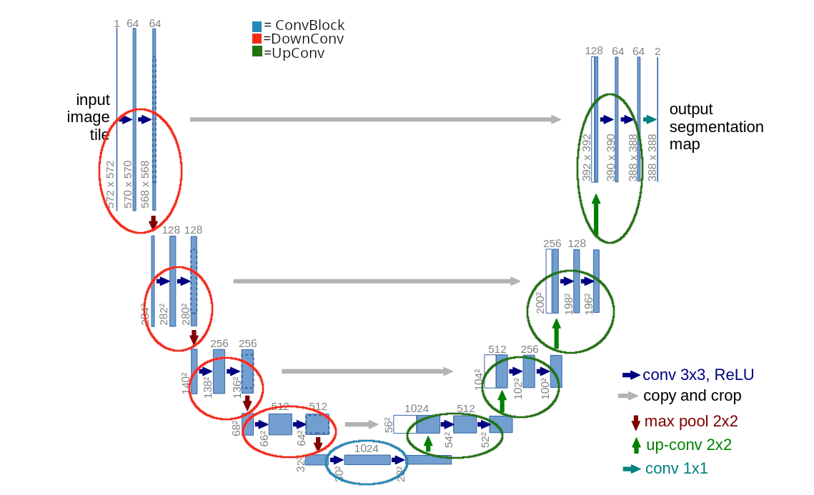

# cs7643-final-project
Semantic segmentation project for CS7643 Summer 2025

## Installation
1. Download and install anaconda
2. Clone the repository
    ```
    git clone https://github.gatech.edu/abustamante31/cs7643-final-project.git
    ```
3. Run the following command in the project directory
    ```
    conda env create -f environment.yml
    ```

## To do
1. ~~Create base U-net implementation~~
2. Implement Dice coefficient metric
3. Implement focal loss function
4. Generate hyperparameter tuning script

## Reference image for U-Net blocks:



